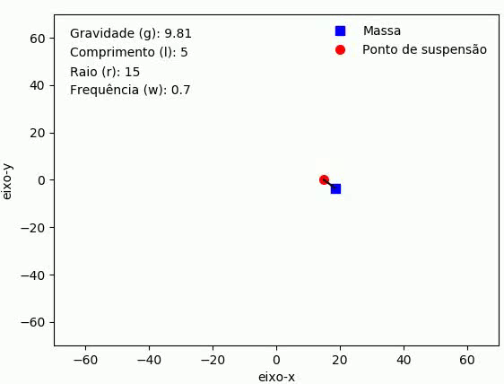

# Este repositório é dedicado a simulação de um pêndulo oscilando com ponto de suspensão em movimento.
## Na figura abaixo temos um pêndulo simples de massa *m* que tem seu ponto de suporte acoplado em uma espira de raio *R* que gira em torno de seu eixo de simetria com uma frequência *w* fixa.

  

## A animação seguinte mostra uma simulação obtida.

  

## Mais detalhes sobre o problema e a resolução do mesmo podem ser encontrados no pdf.

## Autores

| [ @aluizgc](https://github.com/aluizgc) | [ Gabriel R. F. Lopes](https://github.com/aluizgc/proj-classica2) |
| :---: | :---: |

****Instituto de Física e Química****

****Universidade Federal de Itajubá****